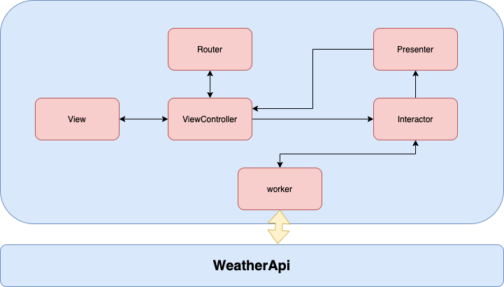

# WeatherApplication
WeatherApplication is an iOS weather app developed in Swift 4.2, it shows the current and forcast weather informations of the city of your choise.  

## Screen shot

## Clean Swift architecture
In an MVC project, your code is organized around and grouped by models, views, and controllers. In Clean Swift, your project structure is built around use case. In other words, we will have a set of components for each use case.
### Communication
The communication between the components is done with protocols. Each component will contain protocols which will be used for receiving and passing data between them. WeatherApi provide the result to Worker, then Worker communicates with Interactor, then Interactor with Presenter and Presenter with ViewController.

### Router
The router takes care for the transition and passing data between view controllers. Also, you can use segues, unlike the VIPER architecture where you can’t do that.
### Worker
The Worker component will handle all the API/CoreData requests and responses. The Response struct (from Models) will get the data ready for the Interactor. It will handle the success/error response, so the Interactor would know how to proceed.
### Interactor
This is the “mediator” between the Worker and the Presenter. Here is how the Interactor works. First, it communicates with the ViewController which passes all the Request params needed for the Worker. Before proceeding to the Worker, a validation is done to check if everything is sent properly. The Worker returns a response and the Interactor passes that response towards the Presenter.
### Presenter
Now that we have the Response from the Interactor, it’s time to format it into a ViewModel and pass the result back to the ViewController. Presenter will be in charge of the presentation logic. This component decides how the data will be presented to the user.
### ViewController
The ViewController will communicate with the Interactor, and get a response back from the Presenter. Also, when there is a need for transition, it will communicate with the Router.
### WeatherApi :
[Here]: https://github.com/djabirsadaoui/WeatherApi

